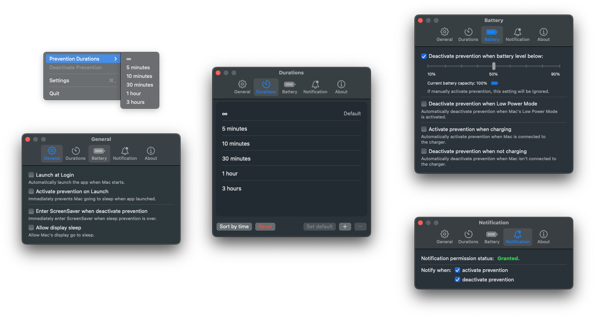
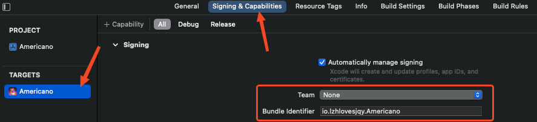

# Americano

Americano is a macOS app designed to prevent your Mac from entering sleep mode. This small utility comes in handy when you need to keep your system awake during specific tasks such as downloads, presentations, or any other scenario where automatic sleep could be disruptive.



## Features

- **Menu Bar Integration** — Lives in your menu bar with a single cup icon. Left-click opens the menu, right-click quickly toggles sleep prevention.
- **Flexible Durations** — Choose from preset durations or create your own custom intervals. Set a default duration for one-click activation.
- **Battery Awareness** — Automatically stop sleep prevention when battery drops below a threshold, when Low Power Mode activates, or based on charger connection status.
- **Notifications** — Optional macOS notifications when sleep prevention activates or deactivates.
- **Launch at Login** — Start automatically when you log in, with optional immediate activation.
- **Auto-Update** — Built-in Sparkle framework checks for updates automatically.
- **Onboarding** — Welcome window on first launch explains menu bar interaction and quick setup.
- **URL Schemes** — Control the app programmatically via custom URL schemes.

## How it works

The app primarily functions as a wrapper for the macOS [caffeinate][2] command-line utility.

## Menu Bar Interaction

| Action | Behavior |
|--------|----------|
| Left-click | Opens the menu to choose duration, open settings, or quit |
| Right-click | Quickly toggles sleep prevention on/off |

## URL Schemes

You need to launch Americano first.

* **Activate** (with optional duration): `americano:///activate?hours={hours}&minutes={minutes}&seconds={seconds}`
  * Example: `americano:///activate?hours=1&minutes=30` — Activates for 1 hour 30 minutes
  * Example: `americano:///activate` — Activates with the default duration
* **Deactivate**: `americano:///deactivate`
* **Toggle**: `americano:///toggle`

## Settings

Open Settings from the menu bar menu (or press **⌘,** when the menu is open).

### General
- **Launch at Login** — Automatically start Americano when you log in
- **Activate prevention on Launch** — Immediately prevent sleep when the app starts
- **Enter ScreenSaver when deactivate prevention** — Trigger screen saver when the timer ends
- **Allow display sleep** — Keep the system awake but let the display sleep

### Durations
Manage preset time intervals:
- Add custom durations with a time picker
- Remove or reorder intervals
- Mark any interval as the default
- Reset to built-in presets

### Battery
Available on Macs with a battery:
- **Battery Level** — Auto-deactivate when battery drops below a set percentage
- **Low Power Mode** — Auto-deactivate when macOS Low Power Mode turns on
- **Charging** — Auto-activate when plugged in, auto-deactivate when unplugged

### Notification
- Request macOS notification permission
- Enable notifications for activation and/or deactivation events

### About
- View current version and build number
- Re-open the welcome onboarding window
- Check for software updates

## System requirements

- macOS 14.0 and later

## How to build

1. Clone this repo:

   ```bash
   git clone git@github.com:LZhenHong/Americano.git
   ```

2. Open `Americano.xcodeproj` with Xcode.

3. Use your own Team and change the Bundle Identifier.



## Dependencies

Americano uses the following Swift Package Manager dependencies:

- [StorageMacro](https://github.com/LZhenHong/StorageMacro) — Automatic `UserDefaults` persistence via `@storage` macro
- [SettingsKit](https://github.com/LZhenHong/SettingsKit) — Settings window framework
- [Sparkle](https://github.com/sparkle-project/Sparkle) — Auto-update framework

## Contributions

Pull requests and issues are welcome! If you encounter any issues or have suggestions for improvement, feel free to submit an issue.

## License

This project is licensed under the [MIT License][1].

> [!NOTE]
> If you are using **Bartender 5** and have hidden the menu bar icon, please be aware that the status display of the Americano menu bar icon may be inaccurate.

[1]: https://github.com/LZhenHong/Americano/blob/main/LICENSE
[2]: https://ss64.com/osx/caffeinate.html
