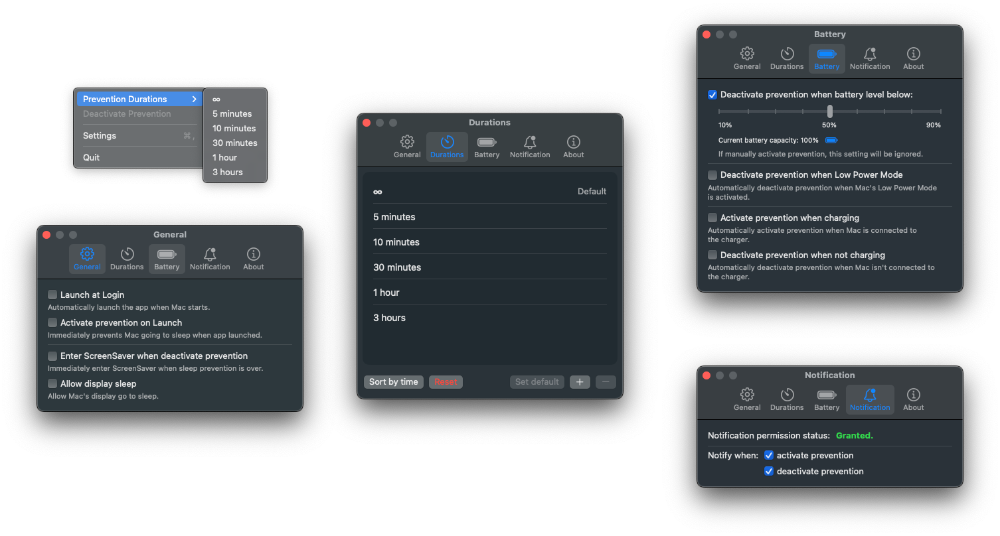

# Americano

Americano is a macOS app designed to prevent your Mac from entering sleep mode. This small utility comes in handy when you need to keep your system awake during specific tasks such as downloads, presentations, or any other scenario where automatic sleep could be disruptive.



## How it works

The app primarily functions as a wrapper for the macOS [caffeinate][2] command-line utility. 

## URL Schemes

You need launch Americano first.

* Activate: `americano:///activate?hours={hours}&minutes={minutes}&seconds={seconds}`
* Deactivate: `americano:///deactivate`
* Toggle: `americano:///toggle`

## System requirements

- macOS 13.5 and later

## How to build

1. Clone this repo:

   ```bash
   git clone git@github.com:LZhenHong/Americano.git
   ```

2. Open `Americano.xcodeproj` with Xcode.

3. Use your own Team and change the Bundle Identifier.

<!-- () -->

## Contributions

Pull requests and issues are welcome! If you encounter any issues or have suggestions for improvement, feel free to submit an issue.

## License

This project is licensed under the [MIT License][1].

> [!NOTE]
> If you are using **Bartender 5** and have hidden the menu bar icon, please be aware that the status display of the Americano menu bar icon may be inaccurate.

[1]: https://github.com/LZhenHong/Americano/blob/main/LICENSE
[2]: https://ss64.com/osx/caffeinate.html
